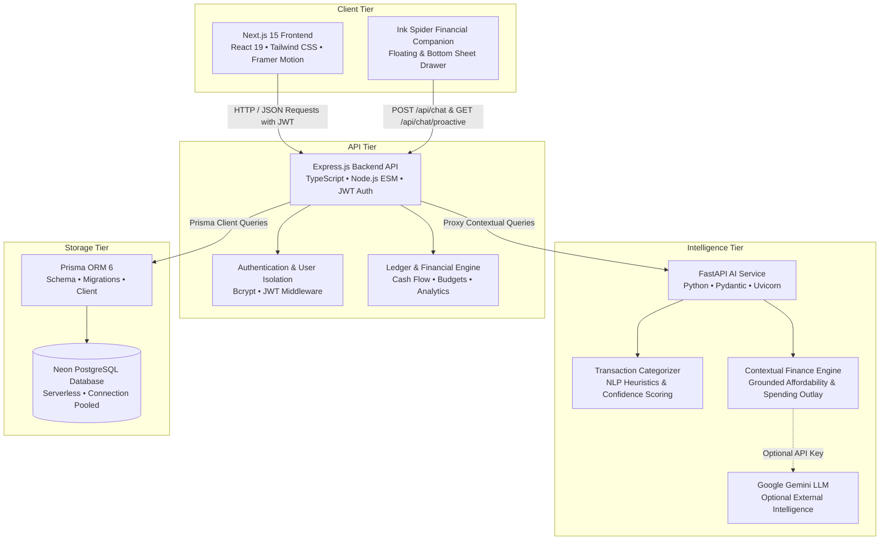
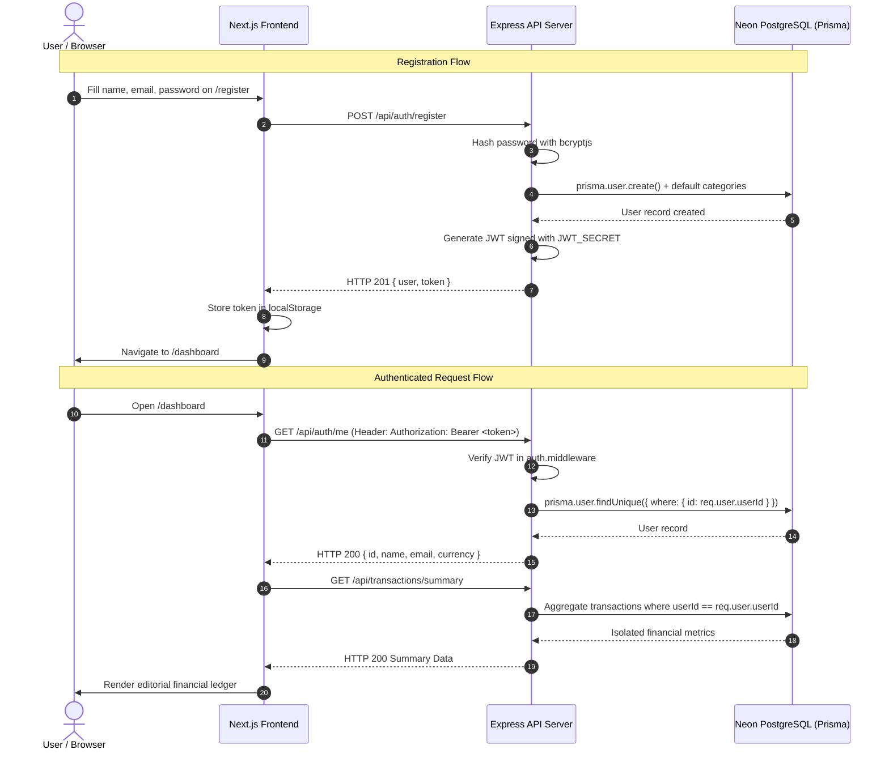
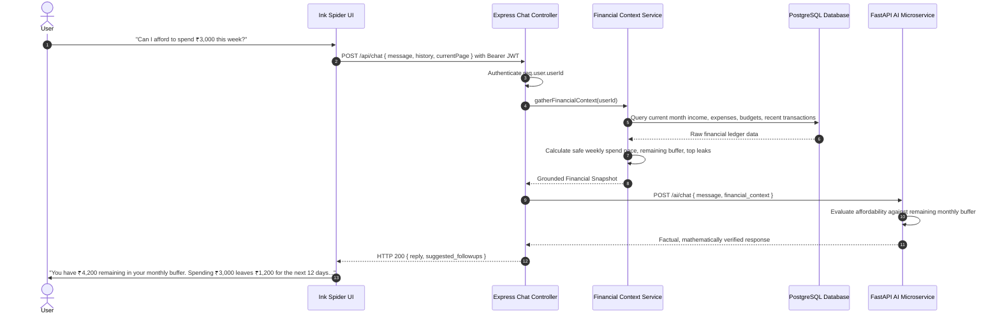
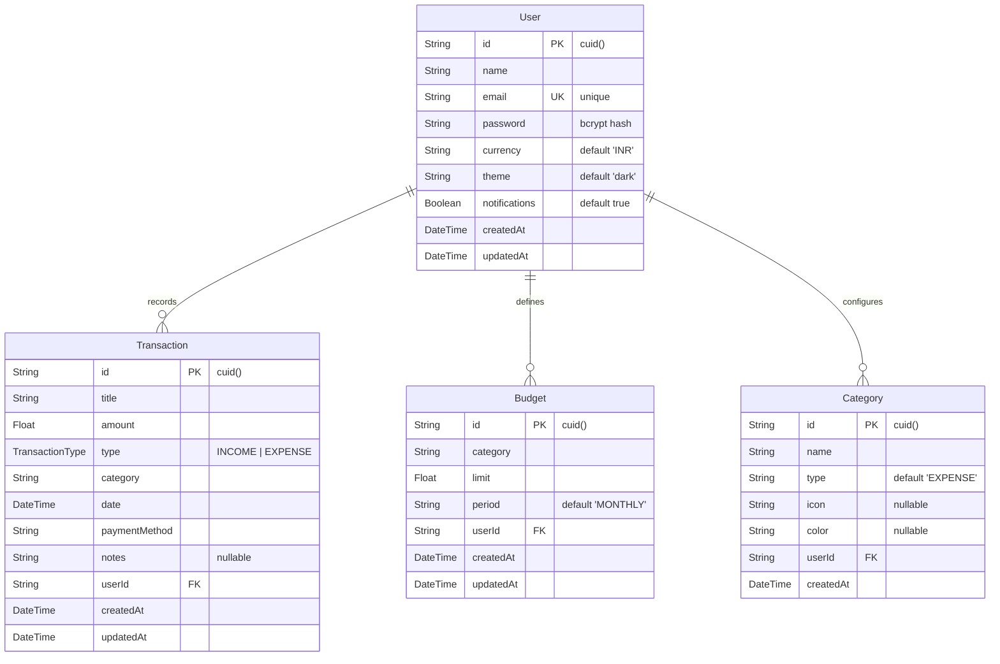

# verde — Smart Personal Finance & Editorial Expense Tracker

An editorial, full-stack personal finance application with real-time financial tracking, budget caps, multi-currency support, and a grounded **Ink Spider** AI Financial Companion living inside the ledger.

---

## Architecture Overview



---

## Key Features

### 1. Robust Authentication & Data Isolation
* **Zero-Mock Security**: Bcrypt-salted password hashing and stateless JSON Web Tokens (JWT).
* **Complete User Isolation**: Every database query scopes transactions, budgets, and categories strictly to `req.user.userId`.
* **Standard Auth Flow**: Unified `register`, `login`, `logout`, and `/api/auth/me` session validation with zero demo bypasses.

### 2. Transaction Journal (Incomes & Expenses)
* **Unified Model**: Supports both `INCOME` and `EXPENSE` entries.
* **Full CRUD Operations**: Create, view, inline modify, and delete transactions.
* **Filtering & Sorting**: Live full-text search, filter by category/type, sort by date or amount.
* **Data Export**: Export itemized journal logs to standard CSV or print-ready audit views.

### 3. Real-Time Financial Dashboard
* **Editorial Composition**: Clean, bold typography and asymmetric data blocks communicating:
  * `01 / Primary Net Worth`: Total net balance formatted with tabular numbers.
  * `02 / Flow Timeline`: Multi-period income vs. expense comparison via Recharts.
  * `03 / Pressure Points`: Active category budget caps with visual threshold warnings.
  * `04 / Journal Stream`: Live stream of itemized recent transactions.
* **Zero Hallucination**: 100% calculated from real database records.

### 4. Category Budgets & Spending Caps
* **Configurable Limits**: Set monthly category expenditure caps.
* **Utilization Tracking**: Dynamic progress indicators with color-coded status (Normal, Warning at 80%, Over-Budget at 100%).
* **Safe Spend Guidance**: Real-time remaining budget calculations based on current month progress.

### 5. Financial Diagnostics & Analytics
* **Category Allocation Matrix**: Donut distribution breakdown with percentage shares.
* **Multi-Month Comparison**: Bar charts tracking cash flow trends across billing cycles.
* **Savings Ratio**: Live computation of user savings discipline and peak outlay concentration.

### 6. Personal Financial Companion ("Ink Spider")
* **Original Design**: Hand-inked abstract geometric spider mascot representing connection, awareness, and catching spending leaks.
* **Context-Aware Insights**: Automatically recognizes the user's active page (`/dashboard`, `/expenses`, `/budgets`, `/analytics`) to tailor suggested questions.
* **Grounded Affordability Analysis**: Answers questions like *"Can I afford to spend ₹2,500 this week?"* or *"Where is my money going?"* using exact numbers from the user's database records.
* **Accessibility**: Single source of truth open/close state, dismissal via `Escape` key, and outside-click detection.

---

## Authentication Lifecycle



---

## AI Financial Companion Data Flow



---

## Database Schema (ERD)



---

## Technology Stack

| Layer | Technology | Details |
| :--- | :--- | :--- |
| **Monorepo Manager** | [pnpm Workspaces](https://pnpm.io/) | `pnpm@9.15.0` multi-package management |
| **Frontend** | [Next.js 15.3.3](https://nextjs.org/) | App Router, React 19.1.0, TypeScript 5.7 |
| **Styling** | [Tailwind CSS 3.4.17](https://tailwindcss.com/) | Custom Editorial Fintech Design System, Dark Mode |
| **Animations** | [Framer Motion 13.1.1](https://www.framer.com/motion/) | Subtle drawer transitions & vector mascot kinematics |
| **Charts** | [Recharts 2.14.0](https://recharts.org/) | Responsive SVG Area, Bar, and Donut charts |
| **Icons** | [Lucide React](https://lucide.dev/) | Consistent, lightweight vector icon set |
| **Backend API** | [Express.js 4.21.1](https://expressjs.com/) | Node.js (ESM), TypeScript, RESTful endpoints |
| **ORM** | [Prisma 6.19.3](https://www.prisma.io/) | Declarative schema, migrations, type-safe queries |
| **Database** | [Neon PostgreSQL](https://neon.tech/) | Serverless PostgreSQL with connection pooling & SSL |
| **Authentication** | [jsonwebtoken](https://github.com/auth0/node-jsonwebtoken) + [bcryptjs](https://github.com/dcodeIO/bcrypt.js) | Salted password hashes & stateless JWT tokens |
| **AI Microservice** | [FastAPI 0.115.0](https://fastapi.tiangolo.com/) | Python 3.10+, Uvicorn ASGI, Pydantic v2 |
| **AI Engines** | Grounded Heuristics + Gemini | Factual financial evaluation engine + Google Gemini API |

---

## Project Structure

```
expense-tracker/
├── package.json                   # Root monorepo workspace scripts
├── pnpm-workspace.yaml            # Monorepo package declarations
├── apps/
│   ├── frontend/                  # Next.js 15 Web Application
│   │   ├── app/
│   │   │   ├── layout.tsx         # Global root layout with Financial Companion
│   │   │   ├── globals.css        # Editorial fintech tokens & ink texture
│   │   │   ├── page.tsx           # Editorial landing page
│   │   │   ├── login/page.tsx     # Secure user login with prefill helper
│   │   │   ├── register/page.tsx  # User registration
│   │   │   ├── dashboard/page.tsx # Financial summary & cash flow charts
│   │   │   ├── expenses/page.tsx  # Transaction journal with filters & CSV export
│   │   │   ├── add-expense/page.tsx # Transaction creation with AI categorization
│   │   │   ├── budgets/page.tsx   # Category budget caps & usage tracking
│   │   │   ├── analytics/page.tsx # Category allocation matrix & multi-period trends
│   │   │   └── settings/page.tsx  # Currency, profile, and notification settings
│   │   ├── components/
│   │   │   ├── Sidebar.tsx        # Responsive navigation sidebar
│   │   │   ├── Navbar.tsx         # Top bar with currency and user chip
│   │   │   └── companion/
│   │   │       ├── InkSpider.tsx  # Hand-inked abstract spider mascot
│   │   │       └── FinancialCompanion.tsx # Accessible drawer chat assistant
│   │   ├── lib/
│   │   │   ├── api.ts             # Type-safe API client with JWT bearer header
│   │   │   ├── auth-context.tsx   # React authentication context provider
│   │   │   └── currency.ts        # Multi-currency formatting utilities
│   │   └── tailwind.config.ts     # Editorial color palette configuration
│   │
│   ├── backend/                   # Express.js REST API
│   │   ├── prisma/
│   │   │   └── schema.prisma      # PostgreSQL schema definitions
│   │   └── src/
│   │       ├── server.ts          # Server entry point
│   │       ├── app.ts             # Express app setup & CORS middleware
│   │       ├── routes/            # Route declarations (auth, transactions, budgets, etc.)
│   │       ├── controllers/       # Business logic controllers
│   │       ├── services/          # Data layer services & financial context engine
│   │       ├── middleware/        # JWT authentication middleware
│   │       └── utils/             # Password hashing, JWT helpers, demo seeder
│   │
│   └── ai/                        # FastAPI AI Microservice
│       ├── main.py                # Categorization & grounded chat endpoints
│       └── requirements.txt       # Python dependencies (fastapi, uvicorn)
```

---

## API Reference

### Authentication (`/api/auth`)
| Method | Endpoint | Description | Auth Required |
| :--- | :--- | :--- | :--- |
| `POST` | `/api/auth/register` | Register new user account | No |
| `POST` | `/api/auth/login` | Authenticate credentials & return JWT | No |
| `GET` | `/api/auth/me` | Fetch active authenticated user profile | **Yes** |

### Transactions (`/api/transactions`)
| Method | Endpoint | Description | Auth Required |
| :--- | :--- | :--- | :--- |
| `GET` | `/api/transactions` | Query filtered & sorted transactions | **Yes** |
| `POST` | `/api/transactions` | Record new transaction (Income/Expense) | **Yes** |
| `PUT` | `/api/transactions/:id`| Update existing transaction record | **Yes** |
| `DELETE` | `/api/transactions/:id`| Remove transaction record | **Yes** |
| `GET` | `/api/transactions/summary` | Get aggregated net worth, trends, and KPIs | **Yes** |

### Budgets (`/api/budgets`)
| Method | Endpoint | Description | Auth Required |
| :--- | :--- | :--- | :--- |
| `GET` | `/api/budgets` | Fetch monthly category budget limits & usage | **Yes** |
| `POST` | `/api/budgets` | Create or update budget cap | **Yes** |
| `DELETE` | `/api/budgets/:id` | Remove budget cap | **Yes** |

### AI & Companion (`/api/ai` & `/api/chat`)
| Method | Endpoint | Description | Auth Required |
| :--- | :--- | :--- | :--- |
| `POST` | `/api/ai/categorize` | Auto-classify transaction description via NLP | **Yes** |
| `POST` | `/api/chat` | Send message to Financial Companion | **Yes** |
| `GET` | `/api/chat/proactive`| Fetch route-contextual proactive spending observations | **Yes** |

---

## Getting Started

### Prerequisites
* **Node.js**: `v20.0.0` or higher
* **pnpm**: `v9.0.0` or higher (`corepack enable && corepack prepare pnpm@latest --activate`)
* **Python**: `v3.10` or higher (with `pip`)
* **PostgreSQL Database**: Neon serverless database URL or local PostgreSQL instance

---

### Installation & Setup

1. **Clone the repository**:
   ```bash
   git clone https://github.com/your-username/expense-tracker.git
   cd expense-tracker
   ```

2. **Install all dependencies**:
   ```bash
   pnpm install
   ```

3. **Configure Environment Variables**:

   **`apps/backend/.env`**:
   ```env
   PORT=5000
   DATABASE_URL="postgresql://<user>:<password>@<host>/<database>?sslmode=require"
   JWT_SECRET="your_secure_jwt_secret_key_here"
   AI_SERVICE_URL="http://localhost:8000"
   ```

   **`apps/frontend/.env.local`**:
   ```env
   NEXT_PUBLIC_API_URL="http://localhost:5000"
   ```

   **`apps/ai/.env`**:
   ```env
   PORT=8000
   GEMINI_API_KEY="your_optional_gemini_api_key_here"
   ```

4. **Initialize Database Schema**:
   ```bash
   cd apps/backend
   npx prisma db push
   cd ../..
   ```

---

### Running Locally

You can launch all services in parallel using pnpm:

```bash
# Start Frontend, Backend, and AI services concurrently
pnpm dev
```

Or run individual services in separate terminals:

```bash
# Terminal 1: Backend API (Port 5000)
pnpm dev:backend

# Terminal 2: Next.js Frontend (Port 3000)
pnpm dev:frontend

# Terminal 3: FastAPI AI Microservice (Port 8000)
pnpm dev:ai
```

Once started:
* **Frontend**: Open [http://localhost:3000](http://localhost:3000) in your browser.
* **Backend Health Check**: [http://localhost:5000/api/health](http://localhost:5000/api/health)
* **AI Service Docs**: [http://localhost:8000/docs](http://localhost:8000/docs)

---

### Building & Verification

Verify TypeScript compilation, Next.js page generation, and code quality across the entire monorepo:

```bash
# Build all packages
pnpm build

# Run linting across all packages
pnpm lint
```

---

## License
Distributed under the MIT License. See `LICENSE` for more information.
